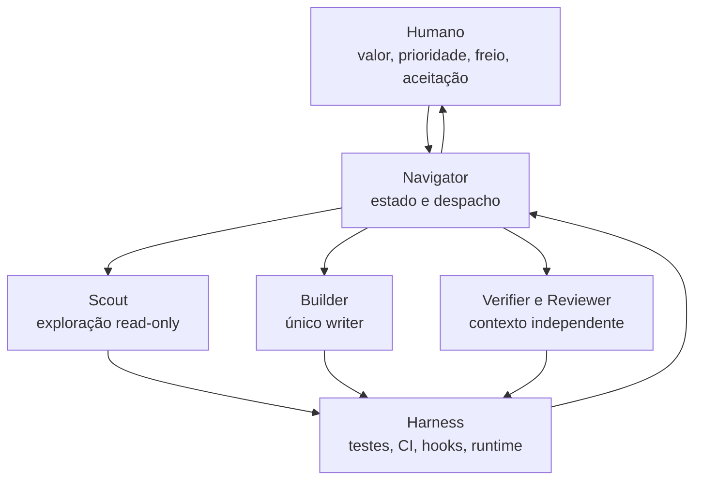
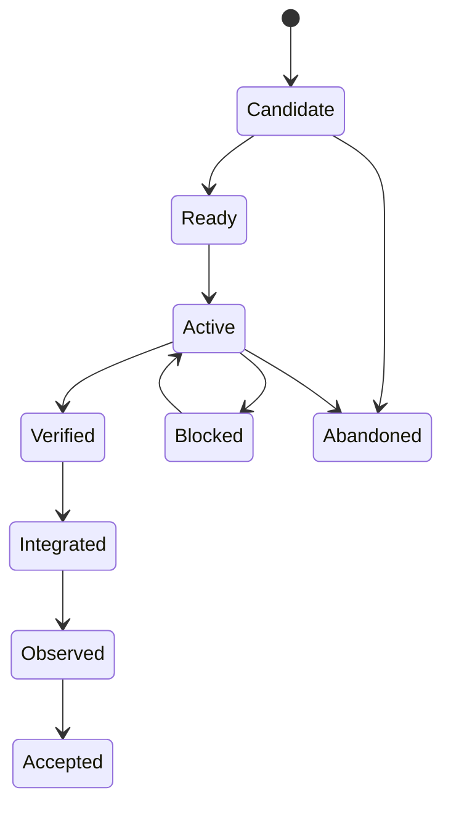

# Agile Vibe Coding Operating System

Versão 0.1 — blueprint de referência para Cezar Augusto Ferreira
Data: 21 de agosto de 2026

## Resumo executivo

A recomendação é substituir o SDD sequencial como caminho padrão por um
operating system de engenharia baseado em XP:

> humano define valor, prioridade, limites e aceitação; o agente implementa em
> fatias verticais pequenas; testes, CI, runtime e verificadores independentes
> produzem o feedback que dirige o próximo passo.

O SDD atual não deve ser descartado. Ele deve mudar de posição:

- deixa de ser o funil obrigatório para toda mudança;
- passa a ser um pacote de governança acionado por risco;
- preserva seus melhores mecanismos — contratos vivos, verificadores isolados,
  severidade, autorização e rastreabilidade — apenas quando eles reduzem um
  risco concreto;
- deixa de exigir que uma representação textual do futuro esteja “PRONTA”
  antes de obtermos a primeira evidência executável.

O nome usado neste documento é **AVC/XP** — Agile Vibe Coding com Extreme
Programming. “Vibe” significa direção humana contínua, descoberta empírica e
conversa com o par; não significa ausência de testes ou deixar o agente
trabalhar sozinho.

O sistema é extremamente completo por **composição**, não por obrigatoriedade:

- cinco papéis estáveis;
- dez skills reutilizáveis;
- uma fonte operacional de estado;
- três faixas de risco;
- um oráculo de aceitação independente;
- um grafo de trabalho dinâmico;
- gates e hooks executáveis;
- adaptadores para Codex, Claude Code e OpenCode;
- especialistas e artefatos ativados sob demanda.

O caminho `flow` precisa chegar ao primeiro sinal executável em minutos. A
faixa `governed` pode usar praticamente todo o SDD atual.

---

## 1. A decisão de desenho

### 1.1 A unidade de trabalho

A unidade de trabalho não é um prompt, documento, task ou arquivo. É:

> um comportamento vertical, pequeno, observável, verificável e potencialmente
> entregável.

Uma fatia vertical atravessa apenas as camadas necessárias para produzir valor
observável. “Criar repository”, “criar endpoint” e “criar componente” são
atividades; “usuário consegue cancelar o agendamento e vê o novo estado” é uma
fatia.

### 1.2 A regra de distribuição de mecanismos

| Necessidade | Mecanismo correto |
| --- | --- |
| Conversa, julgamento, priorização ou isolamento de perspectiva | Agent |
| Procedimento repetível com entradas e saídas | Skill |
| Regra objetiva que não pode depender da boa vontade do modelo | Hook, script, teste, lint ou CI |
| Fato durável que toda sessão precisa conhecer | `AGENTS.md` curto |
| Estado transitório da história ativa | Um único `.avc/run.yaml` |
| Interface ou decisão durável e cara de reverter | Contrato ou ADR sob demanda |
| Integração com sistema externo | MCP/tool com menor privilégio |
| Prova já disponível no repositório ou pipeline | Referência a Git/CI, nunca cópia narrativa |
| Conhecimento descoberto durante uma sessão | Primeiro teste/hook; documentação apenas se necessário |

Regra central:

> Skills não concedem autoridade; agentes concedem autoridade. Hooks não
> “pensam”; fiscalizam. O estado não explica todo o produto; coordena a
> execução.

### 1.3 As invariantes

1. WIP padrão igual a uma história e um nó de implementação.
2. No máximo um writer por superfície mutável.
3. O builder nunca aprova o próprio trabalho.
4. O builder pode escrever testes internos, mas não controla sozinho o oráculo
   de aceitação.
5. A aceitação não pode ser relaxada silenciosamente depois do início.
6. A faixa de risco pode subir automaticamente; só o humano pode reduzi-la.
7. Toda alegação de sucesso aponta para evidência fresca no `HEAD` atual.
8. Falha, ausência, saída ilegível ou evidência stale bloqueiam um gate
   obrigatório.
9. Toda expansão de escopo é um amendment explícito.
10. Feedback executável tem precedência sobre completude documental.
11. Commits, push, PR, merge, deploy e efeitos externos obedecem à política
    explícita do projeto e do humano.
12. Nenhum mecanismo persiste sem proprietário, consumidor e regra de
    invalidação.

---

## 2. Por que isso combina com a evidência

O caso do Akita não foi um “one-shot”. O prompt inicial era substancial e pediu
um plano, mas foi apenas o primeiro de mais de mil prompts. No relato completo,
o sistema chegou a 274 commits e 1.323 testes; somente 37% dos commits eram
features. O restante era correção, hardening, segurança, infraestrutura, testes
e documentação. Cada commit passava CI, e várias necessidades só apareceram
depois de observar o software funcionando. A conclusão operacional é iteração
disciplinada com XP, não geração a partir de uma especificação imóvel.
([relato inicial](https://akitaonrails.com/en/2026/02/16/vibe-code-zero-to-production-in-6-days-the-m-akita-chronicles/),
[análise completa](https://akitaonrails.com/en/2026/02/20/zero-to-post-production-in-1-week-using-ai-on-real-projects-behind-the-m-akita-chronicles/),
[primeiro prompt](https://gist.github.com/akitaonrails/d2a7983fc4c839b8071f5d0babaadf94))

A avaliação de ferramentas de SDD publicada por Birgitta Böckeler identifica
um risco semelhante: abordagens elaboradas geram muitos arquivos e podem
amplificar review overload, rigidez e alucinações. O princípio “spec-first”
pode ser útil, mas seu tamanho e seu papel precisam depender do tipo e do risco
da mudança.
([Martin Fowler](https://martinfowler.com/articles/exploring-gen-ai/sdd-3-tools.html))

A pesquisa DORA descreve o “verification tax”: geração mais rápida transfere
carga cognitiva para auditoria e review. A contramedida não é gerar mudanças
maiores; é reduzir batch size e trazer feedback para perto da autoria.
([DORA](https://dora.dev/insights/balancing-ai-tensions/))

Para contexto, a estratégia recomendada é progressive disclosure: manter
identificadores leves e recuperar arquivos relevantes just-in-time, em vez de
pré-carregar todo o corpus. Para execução longa, harnesses com gerador e
avaliador separados, contratos testáveis por fatia e avaliação no produto real
produzem resultados melhores do que um agente solitário.
([context engineering](https://www.anthropic.com/engineering/effective-context-engineering-for-ai-agents),
[harness design](https://www.anthropic.com/engineering/harness-design-long-running-apps))

### 2.1 Diagnóstico do `sdd-template` atual

O repositório atual é coerente e rigoroso. O problema é a posição do rigor no
fluxo:

- mesmo a trilha `small` percorre 00 → 01 → 03 → 04 → 06 → 08 → 10;
- antes do primeiro código, surgem incremento, brief, PRD, impactos
  contratuais, INDEX, tasks, Gherkin, checklist e auditoria;
- a etapa 04 exige um relatório textual `PRONTO` antes da implementação;
- a etapa 06 carrega todo o contexto canônico;
- review e QA acontecem depois do lote de implementação;
- várias fontes repetem intenção, status, escopo, rastreabilidade e evidência.

Isso otimiza a consistência das representações antes de otimizar o ciclo de
feedback. Para trabalho incerto, parte dessas representações envelhece assim
que o primeiro teste, integração ou uso real revela algo novo.

O novo sistema mantém a qualidade e inverte a ordem:

```text
evidência pequena → aprendizado → próxima decisão → nova evidência
```

em vez de:

```text
representação completa → auditoria da representação → lote de código → feedback
```

---

## 3. Arquitetura do sistema



O sistema tem quatro planos:

| Plano | Conteúdo | Fonte de verdade |
| --- | --- | --- |
| Produto | outcome, exemplos, não objetivos, aceitação | `story` em `run.yaml` + decisão humana |
| Execução | fase, grafo, superfície autorizada, amendments | `.avc/run.yaml` |
| Engenharia | arquitetura curta, comandos, padrões, invariantes | código, testes, `AGENTS.md` e `.avc/config.yaml` |
| Evidência | comandos, resultados, CI, screenshots, runtime | Git/CI + `.avc/evidence/` |

### 3.1 Kernel e extensões

O **kernel** é sempre instalado:

- `AGENTS.md` curto;
- `.avc/config.yaml`;
- `.avc/run.yaml` por história ativa;
- cinco roles;
- skills centrais;
- policy de paths;
- captura de evidência;
- CI.

As **extensões** são ativadas por gatilho:

- live QA/browser;
- revisão de segurança;
- threat model;
- ADR;
- contrato de API/evento;
- plano de migração;
- performance budget;
- acessibilidade;
- rollout, canary e rollback;
- SDD completo.

---

## 4. As três faixas de risco

### 4.1 `flow` — caminho padrão

Use quando a mudança for pequena, reversível, isolada, observável e coberta por
um harness conhecido.

Obrigatório:

- story capsule de uma tela;
- scout mínimo;
- baseline conhecido;
- oráculo ou witness de aceitação;
- red/green/refactor;
- diff review independente;
- checks focados e CI;
- aceitação humana do outcome.

Artefatos permanentes extras: nenhum por padrão.

### 4.2 `guarded`

Use quando houver múltiplos componentes, interface externa, persistência,
concorrência, risco operacional moderado ou reversão menos trivial.

Adiciona:

- impact map;
- review independente obrigatório;
- contrato ou ADR quando o gatilho exigir;
- live QA/preview quando houver experiência observável;
- estratégia de rollout e rollback;
- gates de integração/segurança aplicáveis.

### 4.3 `governed`

Use para autenticação/autorização, billing, PII, compliance, isolamento entre
tenants, perda de dados, migração destrutiva, secrets, infraestrutura crítica
ou mudança irreversível.

Adiciona:

- pacote seletivo ou completo do SDD atual;
- threat model;
- contrato explícito;
- plano e dry-run de migração;
- rollout/canary/rollback verificáveis;
- especialista independente;
- checkpoints humanos;
- evidência formal e retenção definida.

### 4.4 Gatilhos

Promova imediatamente para `governed` se houver qualquer um:

- autenticação, autorização, credenciais ou secrets;
- dinheiro, cobrança, pagamento ou obrigação financeira;
- PII, dados sensíveis, compliance ou isolamento de tenant;
- operação destrutiva, perda de dados ou migração irreversível;
- infraestrutura de produção, CI/CD crítico ou política de acesso;
- blast radius alto sem rollback testado.

Promova no mínimo para `guarded` se houver qualquer um:

- contrato público, API, evento ou consumidor independente;
- schema/persistência não destrutiva;
- nova dependência ou upgrade major;
- múltiplos serviços/camadas com contrato compartilhado;
- concorrência, fila, retry, idempotência ou consistência distribuída;
- performance/SLO;
- UI crítica ou fluxo que exige runtime real;
- baixa observabilidade;
- testes ausentes, lentos ou pouco confiáveis;
- expansão além da superfície inicialmente declarada.

Regras:

- risco desconhecido não cabe em `flow`;
- palavras como “auth”, “billing” ou “migration” são sinais para investigação,
  não prova automática de impacto;
- impacto confirmado ou diff em path sensível promove a faixa;
- o Navigator pode promover a faixa e notifica o humano;
- reduzir a faixa exige decisão humana registrada;
- descoberta de novo risco pausa o Builder e abre `avc-amend`;
- glob de path sensível no `config.yaml` promove automaticamente.

### 4.5 Definition of Done por faixa

| Condição | flow | guarded | governed |
| --- | :---: | :---: | :---: |
| Outcome e não objetivos | ✓ | ✓ | ✓ |
| Oráculo congelado ou witness explícito | ✓ | ✓ | ✓ |
| Testes focados e CI verdes no HEAD atual | ✓ | ✓ | ✓ |
| Diff dentro da superfície autorizada | ✓ | ✓ | ✓ |
| Verifier independente | ✓ | ✓ | ✓ |
| Review independente | leve | ✓ | ✓ |
| Live QA/preview | quando aplicável | ✓ | ✓ |
| Contrato/ADR por gatilho | — | ✓ | ✓ |
| Rollback praticável | reversão simples | ✓ | ✓ |
| Threat/migration/rollout plan | — | — | quando aplicável |
| Aprovações humanas de risco | aceitação | conforme policy | ✓ |
| Observação pós-entrega | curta | definida | definida + SLO |

---

## 5. Máquina de estados

O estado macro permanece pequeno:



O microloop usa uma fase separada:

```text
observe → red → green → refactor → verify
```

Critérios:

- `Candidate`: intenção capturada, ainda não pronta.
- `Ready`: outcome, exemplos, faixa, superfície, reversibilidade, comandos e
  baseline conhecidos.
- `Active`: há exatamente um próximo sinal e um writer autorizado.
- `Verified`: o oráculo independente passou no `HEAD` atual.
- `Integrated`: CI verde e política de integração satisfeita.
- `Observed`: comportamento real/telemetria conferido quando aplicável.
- `Accepted`: humano reconheceu o outcome e não há pendência obrigatória.
- `Blocked`: falta decisão, autoridade, ambiente, evidência ou gate.
- `Abandoned`: hipótese descartada de forma explícita.

Não existe estado universal “spec completa”.

---

## 6. Loops operacionais

### 6.1 Microloop — 2 a 10 minutos

1. Observe o comportamento, teste ou erro atual.
2. Formule uma hipótese e uma previsão verificável.
3. Produza ou selecione o menor sinal vermelho.
4. Faça a menor mudança coerente.
5. Rode o check mais focado.
6. Leia erro, output e diff.
7. Em verde, simplifique sem mudar comportamento.
8. Registre evidência e escolha o próximo sinal.

Guardrails:

- uma hipótese por vez;
- retry budget padrão de duas tentativas sem nova informação;
- nenhuma mudança de aceitação para fabricar verde;
- nenhuma expansão silenciosa de path;
- não rode a suite mais cara quando um check focal responde à pergunta;
- depois de verde, rode o nível de gate exigido pelo checkpoint.

### 6.2 Story loop — 30 minutos a dois dias

1. Humano escolhe o próximo outcome.
2. `avc-start` cria a cápsula e classifica risco.
3. `avc-scout` encontra a menor superfície e o baseline.
4. `avc-freeze-oracle` fixa exemplos/aceitação.
5. Navigator cria somente os próximos 1–3 nós.
6. `avc-build-slice` executa microloops.
7. `avc-verify` avalia em contexto fresco.
8. `avc-review` e `avc-live-qa` entram conforme a faixa.
9. CI e integração.
10. Observação e aceitação humana.
11. `avc-retro` promove apenas o aprendizado durável.

Se a história não produz uma fatia funcional no budget, use `avc-amend` para
fatiar verticalmente. Não responda criando um plano textual maior.

### 6.3 Loop de integração — várias vezes ao dia

- branch curta ou trunk-based;
- commit semanticamente completo;
- CI a cada commit;
- branch principal sempre reversível e verde;
- preview/flag/canary conforme risco;
- merge somente com policy e autoridade satisfeitas.

Meta: build completo em até dez minutos. Se o CI perde velocidade ou confiança,
consertar o harness tem prioridade sobre produzir mais código.

### 6.4 Loop diário — 10 a 15 minutos

- revisar outcomes aceitos, falhas e bloqueios;
- reordenar por evidência;
- escolher apenas o próximo outcome;
- decidir onde o humano precisa estar;
- reservar slack para harness/refatoração.

Não é necessário um stand-up “para o agente”.

### 6.5 Loop semanal — 30 a 45 minutos

- revisar fluxo, qualidade, custo e esforço humano;
- identificar uma única fricção dominante;
- mudar no máximo um mecanismo;
- medir a mudança;
- remover skill, regra ou relatório sem consumidor;
- reservar 10–20% para refatoração, testes e harness.

### 6.6 Horizonte mensal/trimestral

- trabalhar com bets/outcomes, não uma lista fechada de tasks;
- revisar triggers de risco;
- apagar skills não usadas;
- revisar arquitetura a partir de atrito real;
- executar experimentos comparativos.

---

## 7. XP traduzido para engenharia agentic

| Valor ou prática XP | Mecanismo AVC/XP |
| --- | --- |
| Comunicação | Conversa humano–Navigator, exemplos concretos, diff e evidência antes de narrativas |
| Simplicidade | WIP 1, menor fatia, YAGNI, refactor após verde |
| Feedback | teste focal em minutos, CI por commit, live QA e telemetria |
| Coragem | parar, reverter, abandonar hipótese, reduzir escopo e expor incerteza |
| Respeito | authority matrix e findings baseados em fatos |
| Planning Game | humano decide valor/prioridade; agents propõem fatias, riscos e opções |
| User stories | outcome vertical com exemplos, não uma camada técnica |
| On-site customer | humano disponível em intenção, trade-off e aceitação; não em cada tool call |
| Whole team | par principal e especialistas sob demanda, sem silo permanente |
| Pair programming | humano navega; agente dirige; ambos interrompem e simplificam |
| Small releases | cada fatia é integrável, reversível e potencialmente entregável |
| Test-first | oráculo de aceitação fixado antes do builder; testes internos no microloop |
| Customer tests | exemplos de negócio executáveis ou witness humano declarado |
| Refactoring | somente em verde, com evidência antes/depois |
| Simple design | passa testes, revela intenção, não duplica e tem o mínimo de elementos |
| Incremental design | arquitetura emerge; ADR somente para decisão cara de reverter |
| Continuous integration | CI por mudança atômica e principal sempre verde |
| Ten-minute build | fast gates locais e suite completa mantida abaixo do limite |
| Collective ownership | ownership coletivo, com lease temporário de escrita |
| Coding standards | formatter, lint, typecheck, análise estática e hooks |
| System metaphor | mapa e vocabulário curtos no `AGENTS.md` |
| Informative workspace | estado derivado de tests, Git, CI, deploy e observabilidade |
| Sustainable pace | budget de tempo, tokens, retries e capacidade humana de review |
| Slack | capacidade reservada para aprendizado, refactor e harness |
| Spikes | experimento timeboxed que termina em decisão, teste ou abandono |

Ponto essencial: TDD totalmente controlado pelo mesmo agente pode virar teatro.
A independência obrigatória está no **oráculo comportamental e na aprovação**,
não necessariamente em cada teste unitário digitado.

---

## 8. Catálogo de agents

O starter kit contém os contratos canônicos em `.avc/roles/`.

### 8.1 `navigator` — agente principal

Missão:

- manter a conversa no nível de produto e risco;
- manter WIP;
- controlar `run.yaml`;
- selecionar skills e despachar papéis;
- consolidar resultados estruturados;
- detectar quando pedir uma decisão humana.

Pode escrever:

- `.avc/run.yaml`;
- contrato curto da história;
- amendments;
- projeções derivadas.

Não pode:

- autoaceitar outcome;
- alterar código de produção;
- esconder risco;
- reduzir faixa;
- conceder a si próprio autoridade.

### 8.2 `scout` — exploração read-only

Missão:

- localizar paths, símbolos, testes, comandos, precedentes e riscos;
- reproduzir baseline;
- devolver um mapa mínimo e factual.

Não pode:

- editar;
- desenhar um plano detalhado do sistema inteiro;
- transformar suposição em decisão;
- carregar todo o repositório sem necessidade.

### 8.3 `builder` — único writer

Missão:

- implementar um nó vertical;
- escrever testes de desenvolvedor;
- executar red/green/refactor;
- manter o diff mínimo e dentro da superfície.

Pode escrever:

- paths autorizados no nó;
- testes unitários/integrados autorizados.

Não pode:

- editar `run.yaml`, policy, oráculo congelado ou arquivos protegidos;
- mudar faixa, outcome, não objetivos ou escopo;
- adicionar dependência/migração sem autoridade;
- declarar aceitação.

### 8.4 `verifier` — dono do oráculo

Missão:

- derivar exemplos e oráculo a partir do outcome;
- congelar o oráculo;
- verificar o comportamento no `HEAD` atual;
- executar runtime/live QA;
- produzir evidência, não código de produção.

Pode escrever:

- acceptance tests antes do freeze;
- evidência depois do freeze.

Não pode:

- corrigir código;
- relaxar aceitação;
- aprovar saída stale;
- inferir experiência real apenas de teste unitário.

### 8.5 `reviewer` — perspectiva independente

Missão:

- revisar correção, regressão, simplicidade, segurança básica, contratos,
  testes e impacto;
- priorizar bugs reais sobre estilo;
- devolver findings reproduzíveis.

Não pode:

- editar silenciosamente;
- corrigir o próprio finding;
- aprovar o próprio trabalho;
- ampliar o escopo do review sem registrar.

### 8.6 Perfis especializados

Segurança, dados, performance, acessibilidade, arquitetura e compliance são
perfis do Verifier/Reviewer, ativados por faixa. Crie um agente separado apenas
quando ferramentas, sandbox ou isolamento realmente diferirem.

Perfis:

- `security`;
- `data-migration`;
- `contract`;
- `performance`;
- `accessibility`;
- `release-observer`.

### 8.7 Formato obrigatório de retorno

```yaml
status: PASS | FAIL | BLOCKED | NEEDS_AMENDMENT
summary: texto curto
facts: []
changed_paths: []
commands:
  - argv: []
    exit_code: 0
findings:
  - severity: blocker | high | medium | low | note
    claim: ""
    evidence: ""
    recommendation: ""
risks_discovered: []
requested_transition: null
state_revision: 1
head: abc1234
```

O Navigator rejeita retorno:

- sem schema;
- baseado em revisão ou `HEAD` antigos;
- com mudança fora do escopo;
- com afirmação sem evidência;
- com tentativa do Builder de editar o oráculo;
- com finding “resolvido” silenciosamente pelo Reviewer.

---

## 9. Catálogo de skills

Skills são ações. Papéis são identidades.

| Skill | Papel padrão | Resultado |
| --- | --- | --- |
| `avc-start` | Navigator | outcome, exemplos, faixa, surface budget e DoD |
| `avc-scout` | Scout | mapa mínimo, comandos, baseline e riscos |
| `avc-freeze-oracle` | Verifier | oráculo executável congelado ou witness explícito |
| `avc-build-slice` | Builder | menor mudança para um sinal por vez |
| `avc-verify` | Verifier | evidência comportamental fresca |
| `avc-review` | Reviewer | findings independentes e decisão |
| `avc-live-qa` | Verifier | evidência do produto real |
| `avc-amend` | Navigator | mudança explícita de contrato, faixa, escopo ou autoridade |
| `avc-spike` | Scout | experimento timeboxed e decisão |
| `avc-retro` | Navigator | uma melhoria promovida ao mecanismo correto |

Toda `SKILL.md` declara:

- quando usar e quando não usar;
- papel autorizado;
- entradas e pré-condições;
- passos;
- output;
- evidências;
- condições de parada;
- ações proibidas.

Uma skill orquestradora pode escolher as demais, mas não deve duplicar todos os
procedimentos em um prompt monolítico.

Não crie skills para chamar diretamente comandos triviais como `git diff` ou
`npm test`. Use skill quando houver um workflow, um guardrail ou um formato de
saída que precisa se repetir.

---

## 10. Estado operacional único

Use `.avc/run.yaml` como fonte única de coordenação. Somente o Navigator o
edita. Subagentes retornam resultados estruturados; o Navigator serializa
transições. Isso evita races.

Campos essenciais:

```yaml
version: avc.dev/v1alpha1
run_id: AVC-0042
revision: 7
head: 8f31c7a

story:
  outcome: Usuário consegue cancelar um agendamento
  value: Evitar contato manual com suporte
  non_goals:
    - Reembolso
  lane: guarded
  lane_reasons:
    - Estado persistido e ação idempotente
  examples:
    - id: ACC-001
      given: Existe um agendamento futuro ativo
      when: O usuário cancela
      then: O estado muda para cancelado na mesma sessão
  definition_of_done:
    - ACC-001 passa no runtime

scope:
  allow:
    - src/schedules/**
    - tests/schedules/**
  deny:
    - migrations/**
    - infra/**
  acceptance_paths:
    - tests/acceptance/AVC-0042/**

commands:
  baseline: ["./bin/test", "tests/schedules"]
  fast: ["./bin/test", "tests/schedules"]
  acceptance: ["./bin/test", "tests/acceptance/AVC-0042"]
  full: ["./bin/ci"]

authority:
  new_dependency: human
  scope_expansion: human
  migration: human
  oracle_change_after_freeze: human
  commit: project_policy
  push: human
  merge: human
  deploy: human

state:
  phase: active
  micro_phase: red
  active_node: N3
  blocked_by: []
  repair_cycles: 0

graph: []
discoveries: []
amendments: []
evidence: {}
```

Regras:

- todo despacho contém `run_id`, `revision` e `head`;
- mudança material incrementa `revision`;
- alteração de `HEAD` invalida evidência afetada;
- saída stale nunca muda o estado;
- evidência aponta para fatos; não vira segunda especificação;
- ao final, o estado é arquivado pelo período necessário ou projetado no PR;
- campos derivados nunca são mantidos manualmente em múltiplos lugares.

### 10.1 Projeções

Views opcionais são geradas, nunca fontes concorrentes:

- plano humano curto;
- quadro de nós;
- resumo de sessão;
- corpo de PR;
- relatório de evidências;
- histórico de amendments.

Editar uma projeção não altera a fonte canônica.

---

## 11. Grafo dinâmico

Não decomponha a história inteira em dezenas de tasks. Mantenha os próximos
1–3 nós observáveis.

```yaml
- id: N3
  kind: implementation
  intent: Fazer ACC-001 passar para o cancelamento nominal
  owner: builder
  depends_on: [N2]
  authorized_paths:
    - src/schedules/**
    - tests/schedules/**
  status: runnable
  created_from: ACC-001
  attempt: 0
  evidence: null
  stop_condition: ACC-001 passa no check focal
```

Estados do nó:

`pending | runnable | running | passed | failed | blocked | stale`.

Scheduler:

1. invalida evidência incompatível com o `HEAD`;
2. calcula nós cujas dependências passaram;
3. prioriza falhas observadas sobre trabalho especulativo;
4. rejeita dispatch sem autoridade ou com lease conflitante;
5. em falha, cria diagnóstico/reparo derivado da evidência;
6. depois de duas tentativas sem nova informação, volta ao Scout ou humano;
7. cria nós futuros somente quando o feedback atual os justifica.

Prioridade:

1. risco/bloqueio/regressão;
2. falha de aceitação;
3. falha de verificação;
4. implementação corrente;
5. review/live QA;
6. refactor;
7. documentação estritamente necessária.

---

## 12. Context engineering

Cada dispatch recebe uma cápsula, não o histórico inteiro:

```yaml
run_id:
revision:
head:
role:
node:
outcome:
acceptance_ids:
allowed_paths:
denied_paths:
relevant_files:
commands:
invariants:
stop_conditions:
output_schema:
```

Regras:

- o Scout descobre detalhes just-in-time;
- não enviar PRD, TechSpec e histórico inteiro “por segurança”;
- referências têm path, hash e motivo de relevância;
- logs brutos ficam fora do contexto principal;
- subagentes devolvem síntese e evidência;
- antes de compactar, persistir somente decisão, hipótese, falha, paths,
  próximo sinal e riscos;
- aprendizado durável entra primeiro em teste/hook/config;
- `AGENTS.md` recebe apenas fatos que uma futura sessão realmente precisa.

Budget recomendado:

- `flow`: cápsula de até uma tela e 3–8 arquivos relevantes;
- `guarded`: cápsula + contratos/ADR acionados;
- `governed`: índice progressivo; ainda assim, carregar por demanda.

---

## 13. Harness e gates

### 13.1 Camadas de feedback

| Nível | Quando | Exemplos |
| --- | --- | --- |
| L0 — focal | a cada microloop | teste único, compile do alvo, lint afetado |
| L1 — checkpoint | após nó verde | módulo, integração local, contract test |
| L2 — story | antes de Verified | acceptance, build, E2E/live QA, review |
| L3 — integration/release | antes de integrar/entregar | CI completa, security, migration dry-run, observabilidade |

### 13.2 Gates fail-closed

| Gate | Condição |
| --- | --- |
| G0 Doctor | comandos resolvidos, ambiente válido, baseline conhecido |
| G1 Frame | outcome, não objetivos, faixa, escopo, reversibilidade e DoD |
| G2 Oracle | aceitação congelada ou witness humano declarado |
| G3 Build | diff no escopo, fast checks verdes, nenhum risco não registrado |
| G4 Verify | critérios passam no `HEAD` atual e evidência é fresca |
| G5 Review | nenhum finding bloqueante; simplicidade/impacto aceitos |
| G6 Integrate | CI atual verde, aprovações presentes, reversibilidade válida |
| G7 Observe | runtime/telemetria confirmam outcome quando exigido |

Fail-closed vale para regras objetivas. Julgamento subjetivo produz finding e
decisão humana; não se disfarça de script determinístico.

### 13.3 Evidência

```json
{
  "run_id": "AVC-0042",
  "node": "N4",
  "head": "8f31c7a",
  "command": ["./bin/test", "tests/acceptance/AVC-0042"],
  "cwd": ".",
  "started_at": "2026-08-21T13:00:00Z",
  "finished_at": "2026-08-21T13:00:08Z",
  "exit_code": 0,
  "assertions": 8,
  "environment": "local",
  "artifacts": [],
  "agent": "verifier"
}
```

“Tests passed” não é evidência suficiente.

### 13.4 Hooks portáteis

| Evento | Ação |
| --- | --- |
| `before_write` | conferir role, allow/deny, lease e arquivos protegidos |
| `after_write` | formatter/lint/check focal barato |
| `after_subagent` | validar schema, revisão, `HEAD` e autoridade |
| `before_compact` | persistir checkpoint mínimo |
| `before_stop` | bloquear conclusão com gate/nó obrigatório pendente |
| `before_commit` | gate da faixa e evidência fresca |
| `ci` | reexecutar policy fora da sessão do agente |

Hooks são defesa em profundidade. Paths, testes e CI também precisam fiscalizar
as invariantes, porque as plataformas têm capacidades diferentes.

---

## 14. Authority matrix

| Ação | Agent autônomo | Autoridade humana |
| --- | --- | --- |
| Ler, pesquisar, reproduzir e rodar testes seguros | sim | não necessária |
| Editar dentro da superfície autorizada | Builder | policy do projeto |
| Refatorar sem mudar comportamento | Builder em verde | policy do projeto |
| Escrever/alterar oráculo antes do freeze | Verifier | validação conforme faixa |
| Alterar oráculo depois do freeze | apenas proposta | aprovação obrigatória |
| Aumentar faixa | Navigator | notificação |
| Reduzir faixa | não | obrigatória |
| Expandir escopo | não | obrigatória |
| Adicionar dependência | proposta | conforme policy |
| Migração destrutiva | não | obrigatória |
| Waiver de gate | não | decisão registrada e com prazo |
| Commit local | conforme `config.yaml` | configurável |
| Push, PR, merge, deploy | conforme policy explícita | checkpoint quando externo/irreversível |
| Aceitar outcome | não | humano/produto |

Least privilege:

- Scout e Reviewer: read-only;
- Verifier: acceptance paths/evidence, nunca produção;
- Builder: somente allowlist do nó;
- Navigator: estado, não produção;
- secrets não entram em prompt, logs ou evidência;
- comandos destrutivos e efeitos externos exigem autorização.

---

## 15. Concorrência e leases

Padrão:

- WIP de uma história;
- um Builder;
- vários readers no mesmo `HEAD`;
- Verifier, Reviewer e perfis podem rodar em paralelo depois do checkpoint;
- Navigator consolida findings antes de voltar ao Builder.

Dois Builders só quando:

- paths são explicitamente disjuntos;
- não há dependência mutável compartilhada;
- o contrato de integração é conhecido;
- existe lease por superfície;
- ganho esperado supera coordenação;
- policy/humano autoriza.

Não paralelizar para “usar mais agents”. Use paralelismo principalmente para:

- exploração;
- pesquisa documental;
- suites independentes;
- avaliação;
- falhas realmente independentes.

Critérios para abrir subagente:

- missão independente;
- saída verificável;
- contexto menor que o principal;
- autoridade estreita;
- output estruturado;
- ganho maior que o custo de handoff.

---

## 16. Artefatos

### 16.1 Estrutura recomendada

```text
AGENTS.md
.avc/
  config.yaml
  run.yaml
  roles/
    navigator.md
    scout.md
    builder.md
    verifier.md
    reviewer.md
  evidence/
  decisions/           # apenas por gatilho
  contracts/           # apenas por gatilho
.agents/
  skills/
    avc-start/SKILL.md
    avc-scout/SKILL.md
    avc-freeze-oracle/SKILL.md
    avc-build-slice/SKILL.md
    avc-verify/SKILL.md
    avc-review/SKILL.md
    avc-live-qa/SKILL.md
    avc-amend/SKILL.md
    avc-spike/SKILL.md
    avc-retro/SKILL.md
.codex/
  agents/              # adapters TOML
  config.toml           # MCP e opções locais do projeto
  hooks.json
  rules/                # política executável de comandos
.ai-memory.toml         # escopo e política de captura do projeto
.claude/
  agents/              # adapters Markdown
  skills/              # symlinks para .agents/skills
  settings.json
.opencode/
  agents/              # adapters Markdown
opencode.json
```

### 16.2 Artefatos sob demanda

| Artefato | Gatilho |
| --- | --- |
| ADR | decisão cara de reverter com alternativas reais |
| API/event contract | interface pública ou consumidor independente |
| Threat model | auth, segredo, PII, input não confiável, permissão |
| Migration plan | mudança persistente ou destrutiva |
| Rollout/rollback | blast radius ou reversão não trivial |
| Performance budget | hot path ou SLO |
| Accessibility checklist | UI relevante |
| Spike note | descoberta que precisa sobreviver à sessão |
| Incident report | falha relevante em produção |
| Full SDD | risco extremo ou exigência contratual/regulatória |

### 16.3 O que não existe no `flow`

- PRD completo;
- TechSpec completo;
- INDEX manual;
- grafo inteiro de tasks;
- auditoria textual `PRONTO`;
- relatório de execução que duplica Git;
- relatório de QA quando o teste/runtime já é evidência estruturada;
- cadeia RF→RNF→BR→FEAT→SCN para uma mudança local sem necessidade.

---

## 17. Adaptadores por plataforma

A política é canônica; o adapter define discovery, tools, modelo e sandbox.

### 17.1 Codex

- instruções do projeto: `AGENTS.md`;
- skills canônicas: `.agents/skills/<name>/SKILL.md`;
- custom agents: `.codex/agents/*.toml`;
- hooks: `.codex/hooks.json`;
- use subagentes principalmente para exploração, testes e review;
- evite writers paralelos.

A documentação oficial do Codex recomenda agentes customizados estreitos e
opinionados, com job e tool surface claros; skills usam progressive disclosure,
e hooks aplicam regras determinísticas.
([subagents](https://learn.chatgpt.com/docs/agent-configuration/subagents),
[skills](https://learn.chatgpt.com/docs/build-skills),
[hooks](https://learn.chatgpt.com/docs/hooks),
[customization](https://learn.chatgpt.com/docs/customization/overview))

### 17.2 Claude Code

- launcher curto: `CLAUDE.md` apontando para `AGENTS.md` e `.avc/config.yaml`;
- agents: `.claude/agents/*.md`;
- skills: `.claude/skills/<name>/SKILL.md`;
- use symlinks das skills para `.agents/skills`, evitando três cópias;
- permissions/hooks em `.claude/settings.json`;
- aceite o trust do workspace para hooks locais.

Claude Code carrega skills sob demanda, suporta symlinks, agents de projeto e
hooks determinísticos.
([skills](https://code.claude.com/docs/en/skills),
[subagents](https://code.claude.com/docs/en/sub-agents),
[hooks](https://code.claude.com/docs/en/hooks-guide))

### 17.3 OpenCode

- instruções: `AGENTS.md`;
- OpenCode descobre diretamente `.agents/skills`, além de
  `.opencode/skills` e `.claude/skills`;
- agents: `.opencode/agents/*.md`;
- commands opcionais podem delegar a subagents com `subtask: true`;
- permissions em agent/config;
- plugin local apenas se for necessário implementar lifecycle events que o
  core não oferece diretamente.

([skills](https://opencode.ai/docs/skills/),
[agents](https://opencode.ai/docs/agents/),
[commands](https://opencode.ai/docs/commands/),
[rules](https://opencode.ai/docs/rules/))

### 17.4 Model tiers

Não fixe nomes de modelos no kernel. Configure classes:

| Classe | Uso |
| --- | --- |
| `fast` | Scout, busca, triagem e checks simples |
| `balanced` | Builder em trabalho claro |
| `deep` | Navigator, Verifier/Reviewer de alto risco e decisões ambíguas |

Independência de avaliação é mais importante que usar modelos diferentes. Em
`governed`, usar outro modelo/provedor pode aumentar diversidade, mas não
substitui testes ou evidência.

---

## 18. Playbooks

### 18.1 Feature pequena

1. Humano: “quero que X aconteça quando Y”.
2. `avc-start`: outcome, um a três exemplos, não objetivos e `flow`.
3. `avc-scout`: paths + teste mais próximo + baseline.
4. `avc-freeze-oracle`: acceptance test ou witness explícito.
5. `avc-build-slice`: um comportamento.
6. `avc-verify`.
7. review leve, CI, aceitação.

Primeiro sinal executável: alvo de até 15 minutos.

### 18.2 Bug

1. Capturar reprodução observável.
2. Classificar severidade e faixa.
3. Congelar teste de regressão/oráculo.
4. Localizar causa, não apenas sintoma.
5. Menor correção.
6. Teste focal, suite afetada, verifier e CI.
7. Se produção: observar e registrar escape.

### 18.3 UI

1. Definir experiência e estados: loading, erro, vazio, sucesso.
2. Scout mapeia componente, API e caminho de execução.
3. Verifier cria exemplos e plano de live QA.
4. Builder implementa walking skeleton.
5. Validar no browser/runtime com screenshot, console e rede quando aplicável.
6. Acessibilidade entra por trigger.

### 18.4 Problema ambíguo

1. Não escrever TechSpec extensa.
2. `avc-spike` com timebox de 30–90 minutos.
3. Produzir uma decisão, protótipo descartável, benchmark ou teste.
4. Abandonar ou converter aprendizado em nova story.
5. Código do spike não vira produção por inércia.

### 18.5 Contrato público

1. Promover para `guarded`.
2. Fixar consumidor, compatibilidade e exemplos.
3. Contract test antes do Builder.
4. Implementar walking skeleton.
5. Review de compatibilidade e rollout.
6. Atualizar contrato vivo depois de observar a entrega.

### 18.6 Migração/segurança/billing

1. Promover para `governed`.
2. Rodar SDD seletivo ou completo.
3. Threat model/impact map/migration plan.
4. Dry-run e rollback testado.
5. Checkpoint humano antes de efeito irreversível.
6. Specialist review e evidência retida.
7. Canary/observação.

### 18.7 Incidente

1. Segurança e restauração antes de documentação.
2. Rollback/mitigação dentro da autoridade.
3. Capturar timeline e evidência.
4. Criar defect story.
5. Teste de regressão/hook antes de narrar uma nova regra.
6. Retro promove uma contramedida mensurável.

### 18.8 Retomar sessão

1. Ler `AGENTS.md`, `.avc/config.yaml` e `.avc/run.yaml`.
2. Verificar `revision`, `HEAD` e working tree.
3. Invalidar evidência stale.
4. Reproduzir o último sinal.
5. Continuar pelo nó runnable; não reconstruir toda a história do chat.

---

## 19. Métricas e experimento

### 19.1 North star

> tempo mediano entre selecionar um outcome e observá-lo aceito em ambiente
> real, sem defeito P1/P2 nos sete dias seguintes.

Calcular por faixa.

### 19.2 Métricas

Fluxo:

- time to first executable feedback;
- time to first working slice;
- cycle/lead time;
- WIP;
- tempo bloqueado;
- frequência de integração/deploy;
- batch size.

Qualidade:

- first-pass acceptance rate;
- repair cycles;
- escaped defects em 7/14 dias;
- rework/reopen;
- change failure/rollback;
- flakiness;
- latência de detecção;
- findings de Reviewer versus Live QA.

Agentic:

- minutos ativos do humano;
- custo/tokens por outcome aceito;
- tool calls e loops;
- retries excedidos;
- taxa de promoção de faixa;
- alterações de aceitação após o freeze;
- contexto carregado versus efetivamente usado;
- handoffs.

Manutenibilidade:

- complexidade e duplicação;
- dependências novas;
- diff size;
- tempo para mudança adjacente;
- regressões na mesma superfície.

Não use LOC, quantidade de prompts, agents, docs, commits ou testes
isoladamente como produtividade.

### 19.3 Experimento A/B

Selecione 12–20 histórias pequenas e comparáveis:

- A: rota atual do SDD;
- B: AVC/XP `flow`.

Controle:

- mesmo produto, pessoa, modelos, ferramentas e budget;
- aceitação definida antes da alocação;
- alternância ou randomização;
- reviewer final cego ao processo;
- histórias `governed` analisadas separadamente.

Hipóteses:

- B reduz em pelo menos 50% o tempo até a primeira fatia;
- B reduz pre-code work e minutos humanos;
- B não piora escaped defects/change failure;
- B reduz batch size;
- B mantém ou melhora alinhamento humano.

Ordem de contramedidas se velocidade subir e qualidade cair:

1. melhorar o oráculo;
2. adicionar live QA;
3. melhorar testes/harness;
4. ajustar trigger de risco;
5. somente então considerar mais documentação.

---

## 20. Migração do `sdd-template`

### 20.1 O que preservar

- contratos vivos;
- severidade P0–P3;
- verificadores em contexto isolado;
- segurança e DoD;
- política explícita de Git;
- adapters multi-tool;
- consolidação e histórico quando necessários;
- gates especializados;
- BDD para comportamento realmente relevante.

### 20.2 O que reposicionar

| Fluxo atual | AVC/XP |
| --- | --- |
| 00 iniciar incremento | `avc-start` em 3–5 minutos |
| 01 PRD | cápsula de outcome; PRD apenas por gatilho |
| 02 TechSpec | ADR/design seletivo em guarded/governed |
| 03 tasks + BDD + impacto | 1–3 nós dinâmicos + oráculo; contrato por gatilho |
| 04 auditoria PRONTO | G0–G2 executáveis; review textual só quando risco exigir |
| 05 rules/skills | `avc doctor/bootstrap` uma vez por repo |
| 06 executar task | `avc-build-slice` em microloops |
| 07 review | Reviewer independente por checkpoint/faixa |
| 08 QA | Verifier/Live QA no runtime |
| 09 corrigir bugs | mesmo defect loop, reprodução primeiro |
| 10 consolidar | integrar, observar, atualizar contrato vivo e arquivar |

### 20.3 O que remover do caminho padrão

- dependência universal de `PRONTO` textual;
- PRD obrigatório para `small`;
- rastreabilidade completa para mudança local;
- duplicação de status em artefatos;
- plano completo antes do primeiro feedback;
- leitura de todo contexto canônico em toda etapa;
- relatórios que apenas recontam Git, testes e CI.

### 20.4 Compatibilidade

No período de transição:

- `flow` usa `.avc/`;
- `guarded` reaproveita contratos/ADRs do SDD;
- `governed` chama os prompts 00–10 aplicáveis;
- o instalador atual pode ganhar um modo `--avc`;
- não migrar histórico antigo;
- não reescrever contratos vivos sem uma entrega real.

---

## 21. Roadmap de implementação

### Fase 0 — baseline

- escolher um projeto real;
- medir três histórias com o processo atual;
- mapear comandos, tempo de CI e qualidade do harness;
- não automatizar ainda.

### Fase 1 — kernel v0.1

Instalar:

- cinco roles;
- `avc-start`, `avc-scout`, `avc-freeze-oracle`,
  `avc-build-slice`, `avc-verify` e `avc-review`;
- `.avc/config.yaml` e `.avc/run.yaml`;
- guard de paths;
- evidência;
- adapter para a ferramenta usada no experimento.

Dogfood em uma história real no primeiro dia.

### Fase 2 — feedback real

- live QA;
- runtime/preview;
- CI por faixa;
- hooks de scope, evidence e stop;
- adapter das outras ferramentas;
- métricas automáticas.

### Fase 3 — guarded

- contracts/ADR triggers;
- specialist profiles;
- rollout/rollback;
- graph scheduler;
- drift check dos adapters.

### Fase 4 — governed

- encapsular o SDD atual como pacote de risco;
- threat/migration/security gates;
- approvals e evidence retention;
- integração com GitHub checks/PRs.

Critério para adicionar qualquer mecanismo:

1. qual falha concreta evita?
2. quem consome?
3. é executável ou apenas textual?
4. quando fica stale?
5. qual custo por história?
6. pode ficar restrito a uma faixa?

Se as respostas forem fracas, não adicionar.

---

## 22. Modos de falha e contramedidas

| Falha | Sintoma | Contramedida |
| --- | --- | --- |
| Waterfall de agents | muitos handoffs antes de teste | default curto, agents sob demanda, WIP 1 |
| TDD teatral | Builder ajusta teste para passar | oráculo independente + amendment |
| Context swamp | toda sessão lê tudo | Scout + progressive disclosure + budget |
| Plano prematuro | tasks envelhecem | grafo dinâmico de 1–3 nós |
| Diff sem limite | “melhorias” adjacentes | allow/deny + lease + hook |
| Verde local falso | unit passa, produto falha | live QA, preview, telemetria |
| Autorrevisão | mesmo agent declara sucesso | contexto independente |
| Paralelismo conflituoso | merge/race de arquivos | um writer; readers paralelos |
| Loop infinito | retries sem informação | budget 2 e escalada |
| Prompt como policy | regra importante ignorada | teste/hook/CI/permissão |
| Explosão de skills | workflows duplicados | métrica de uso e poda |
| Especialista universal | tudo vira governed | triggers explícitos |
| Arquitetura imaginada | design sem evidência | Scout evidence-first |
| Métrica gamificada | muitos commits, pouco valor | north star com qualidade |
| CI lento/flaky | feedback deixa de orientar | prioridade de harness |
| Perda de aprendizado | mesma falha reaparece | teste → hook → config → AGENTS |
| Framework antes do produto | semanas de meta-trabalho | dogfood no dia 1 |
| Aprovação excessiva | humano vira operador | authority matrix |
| Autonomia excessiva | efeito externo surpresa | least privilege |
| Dívida por velocidade | história seguinte piora | refactor after green + slack |
| Docs stale | relato contradiz código | consumidor/invalidation ou exclusão |

---

## 23. Regras de poda

- `flow` deve caber em aproximadamente uma tela.
- Manter no máximo 1–3 nós futuros.
- Não criar agent quando skill/perfil resolve.
- Não criar skill para um comando simples.
- Não promover a primeira falha a regra permanente, exceto falha catastrófica.
- Não manter três cópias manuais de uma skill.
- Não guardar chat como fonte de verdade.
- Não usar documentação como prova de que algo funciona.
- Não automatizar merge/deploy/destruição sem autoridade.
- Não produzir um relatório quando Git/CI/runtime já são a evidência.
- Deletar mecanismos que não mudam decisão ou resultado.

---

## 24. A primeira configuração recomendada

Apesar de todo o catálogo, comece com:

- cinco roles;
- seis skills centrais;
- um `AGENTS.md` de até aproximadamente 150 linhas;
- `.avc/config.yaml`;
- `.avc/run.yaml`;
- guard de paths;
- CI;
- um fluxo de live QA;
- `flow` como default;
- `governed` chamando o SDD existente.

O starter kit ao lado deste documento contém contratos copiáveis. Ele é uma
referência; deve ser adaptado aos comandos e à arquitetura do projeto antes de
ser ativado.

---

## 25. Fontes principais

- Fabio Akita:
  [zero to production](https://akitaonrails.com/en/2026/02/16/vibe-code-zero-to-production-in-6-days-the-m-akita-chronicles/),
  [behind the process](https://akitaonrails.com/en/2026/02/20/zero-to-post-production-in-1-week-using-ai-on-real-projects-behind-the-m-akita-chronicles/),
  [prompt inicial](https://gist.github.com/akitaonrails/d2a7983fc4c839b8071f5d0babaadf94).
- [Extreme Programming — Agile Alliance](https://agilealliance.org/glossary/xp/).
- [Understanding Spec-Driven Development — Martin Fowler](https://martinfowler.com/articles/exploring-gen-ai/sdd-3-tools.html).
- [TDD in the agent loop — Martin Fowler](https://martinfowler.com/articles/exploring-gen-ai/tdd-in-the-agent-loop.html).
- [Balancing AI tensions — DORA](https://dora.dev/insights/balancing-ai-tensions/).
- [Effective context engineering — Anthropic](https://www.anthropic.com/engineering/effective-context-engineering-for-ai-agents).
- [Harness design for long-running apps — Anthropic](https://www.anthropic.com/engineering/harness-design-long-running-apps).
- Codex:
  [customization](https://learn.chatgpt.com/docs/customization/overview),
  [subagents](https://learn.chatgpt.com/docs/agent-configuration/subagents),
  [skills](https://learn.chatgpt.com/docs/build-skills),
  [hooks](https://learn.chatgpt.com/docs/hooks).
- Claude Code:
  [skills](https://code.claude.com/docs/en/skills),
  [subagents](https://code.claude.com/docs/en/sub-agents),
  [hooks](https://code.claude.com/docs/en/hooks-guide).
- OpenCode:
  [skills](https://opencode.ai/docs/skills/),
  [agents](https://opencode.ai/docs/agents/),
  [commands](https://opencode.ai/docs/commands/),
  [rules](https://opencode.ai/docs/rules/).
- [cezaraf/sdd-template](https://github.com/cezaraf/sdd-template).
