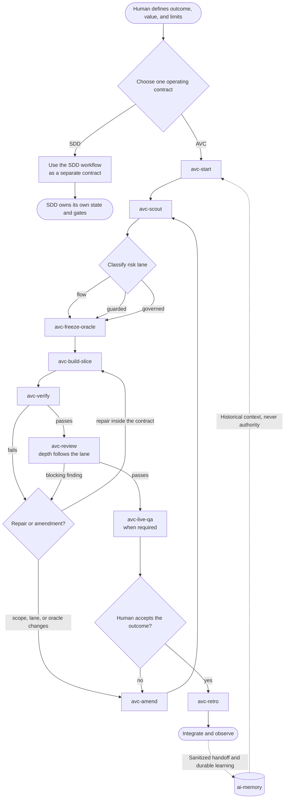

<div align="center">

# AVC Template

**An operating system for AI coding agents.**
Ship small vertical slices with executable acceptance, independent verification,
risk-adaptive governance, and persistent project memory — on Claude Code, Codex,
OpenCode, or any harness that reads `AGENTS.md`.

[](LICENSE)
[](https://github.com/cezaraf/avc-template/generate)
[](#supported-ai-coding-harnesses)
[](https://github.com/akitaonrails/ai-memory)

[Quick start](#quick-start-60-seconds) ·
[How it works](#how-it-works) ·
[Risk lanes](#risk-lanes-governance-that-scales-with-blast-radius) ·
[Harnesses](#supported-ai-coding-harnesses) ·
[FAQ](#faq)

</div>

---

## Why

AI agents are fast at producing code and bad at knowing when to stop. The usual
answers are both wrong:

- **No process** — the agent free-runs, breaks auth or billing, and nobody can
  say which change was verified against what.
- **Heavy spec-driven process for everything** — every one-line fix pays for a
  PRD, a tech spec, a task breakdown, and four review passes before the first
  executable signal.

AVC Template takes the third path: **the human owns value, priority, limits, and
acceptance; the agent implements in small vertical slices; tests, CI, runtime,
and independent verifiers produce the feedback that drives the next step.**
Governance is a dial, not a toll booth — it escalates automatically when a change
touches authentication, money, tenant boundaries, schemas, or production
infrastructure.

Spec-driven development is not thrown away. It remains a separate operating
contract that a team may choose instead of AVC. The two workflows are mutually
exclusive; no AVC lane invokes SDD.

## Quick start (60 seconds)

Install into an existing Git repository (the target must be the repo root):

```bash
curl -fsSL https://raw.githubusercontent.com/cezaraf/avc-template/main/install.sh \
  | bash -s -- --target . --harness auto
```

Preview every file first, without writing anything:

```bash
curl -fsSL https://raw.githubusercontent.com/cezaraf/avc-template/main/install.sh \
  | bash -s -- --target . --harness all --dry-run
```

Then validate the kernel and start working:

```bash
./.avc/scripts/bootstrap-ai-memory.sh   # pinned, loopback-only memory runtime
python3 .avc/bin/avc.py doctor          # environment and contract check
./.avc/scripts/ci.sh                    # structural and policy gates
```

Prefer a fresh repository? Use **[Use this template](https://github.com/cezaraf/avc-template/generate)**,
then run `./install.sh --target . --harness all --force` to replace the
distribution's own bootstrap state.

## How it works

Ask your agent for `avc-start` and the kernel drives the loop:

<!-- avc-flow-diagram:start -->

<!-- avc-flow-diagram:end -->

The SDD branch deliberately has no edge back into an AVC lane: choosing SDD
means using its own workflow, while `flow`, `guarded`, and `governed` remain
native AVC paths.

| Step | What happens |
| --- | --- |
| `avc-start` | Frames one vertical slice, classifies risk, picks the lane |
| `avc-scout` | Reads only the code the slice actually touches |
| `avc-freeze-oracle` | Freezes executable acceptance **before** implementation |
| `avc-build-slice` | Implements the thinnest change that satisfies the oracle |
| `avc-verify` | Runs gates; records HEAD, argv, and exit codes as evidence |
| `avc-review` | Independent reviewer — mandatory on `guarded` and `governed` |

Extra skills cover the rest of the lifecycle: `avc-spike`, `avc-amend`,
`avc-live-qa`, `avc-retro`.

Everything the run depends on is a file you can read and diff:

```text
.avc/config.yaml      commands, lanes, risk triggers, budgets, authority
.avc/run.yaml         the single active operational story
.avc/roles/           Navigator, Scout, Builder, Verifier, Reviewer contracts
.avc/evidence/        gate results bound to a commit, not to a claim
.agents/skills/       10 AVC skills + 5 managed ai-memory skills
AGENTS.md             managed instruction blocks your harness already reads
```

<!-- avc-story:start -->
## The Next Signal: AVC in Practice

When Helena opened the repository for a small rehearsal-planning application
called *Ensemble*, she did not ask the agent to “build the feature.” She gave it
one observable outcome instead:

> A musician can cancel attendance at a rehearsal and immediately see the seat
> become available again.

That was how AVC began: not with a list of files, but with value someone could
observe.

Before touching the code, Helena chose the operating contract:
**AVC, not SDD**. Either model could serve the project, but never at the same
time. The choice lived in `.avc/config.yaml`; the single active story lived in
`.avc/run.yaml`.

She invoked `avc-start`. The agent turned her request into a small capsule:
outcome, examples, boundaries, and non-goals. They would not add notifications,
a waiting list, or billing. Success meant that cancellation remained visible in
the musician's history while another musician could see one newly available
seat.

The story entered the `guarded` lane. It crossed the interface, API, and
database, changing persistence and a contract between components. It was not as
sensitive as authentication or money, but it required rollback, independent
review, and observation through the real application.

Then came `avc-scout`.

The scout did not read the whole repository. It found the rehearsal screen, the
participant endpoint, the enrollment table, and the nearest tests. It also
discovered that cancellation must not delete a row: the historical record had
to remain with a `cancelled` state. That discovery did not become code. It
became a fact in the active run.

Next, a verifier took `avc-freeze-oracle`. Before the Builder wrote production
code, the verifier created one executable example:

> Given a full rehearsal and a confirmed musician, when that musician cancels,
> the enrollment remains in history as cancelled and available seats increase
> by exactly one.

The test failed for the intended reason. The oracle was frozen. From then on,
the Builder could satisfy it, but could not weaken it.

Only then did `avc-build-slice` begin. The Builder received an exact file
allowlist, adjusted the endpoint and persistence, then updated the screen. Each
step followed the same rhythm: red, green, refactor. It ran the smallest useful
check after every change and resisted the temptation to redesign neighboring
modules.

Halfway through, a new idea appeared: notify every musician when a seat became
free.

Helena liked it, but answered, “Not in this story.”

AVC protected the work from its own enthusiasm. Notifications would change
scope, dependencies, and acceptance. Adding them required `avc-amend`, a new
contract revision, and human authority. The idea survived, but the active story
did not drift silently.

When the oracle turned green, `avc-verify` ran the focused tests, affected
checks, doctor, and full suite against one exact tree. Its evidence recorded the
`HEAD`, command arguments, environment, duration, exit code, and artifacts.
“It worked for me” was replaced by a reproducible statement.

Then `avc-review` read the diff independently, without trusting the Builder's
summary. The reviewer found that two simultaneous cancellations could release
the same seat twice. The finding returned to the loop as a reproducible case,
not a vague objection. The Builder repaired the cause, and verification ran
again on the new tree.

Finally, Helena opened the application as a user. She cancelled attendance,
saw the state change, and opened another session where the seat was available.
This was `avc-live-qa`: behavior witnessed through the consumer surface,
separate from local tests and CI.

Every gate had passed, but the agent still did not declare victory.

“Do you accept the outcome?” it asked.

Helena compared the result with the value she had requested, not with the
amount of code produced. “I accept it.”

Only then did `avc-retro` examine the journey. The concurrency failure found in
review became a permanent test. No long rule was necessary; the executable
check was the smallest durable form of that lesson.

Throughout the work, ai-memory carried decisions between sessions. It recalled
why cancelled enrollments were retained and prepared the next handoff. Yet its
role remained **historical context, not authority**. Current instructions, the
active contract, the exact tree, and human decisions always outranked memory.

The next morning, another agent opened the repository. It did not need to
reconstruct the past or invent the future. It read the contract, consulted the
memory as evidence, and asked the question that keeps AVC moving:

> What is the next small outcome someone needs to observe?
<!-- avc-story:end -->

## Risk lanes: governance that scales with blast radius

One dial, three settings. Risk is inferred from confirmed impact and changed
paths — keywords alone are only a signal, never a verdict.

| Lane | Triggered by | Review | Extras |
| --- | --- | --- | --- |
| `flow` | Everything else | Light | First executable signal in minutes |
| `guarded` | Public API, event contract, schema, new dependency, concurrency, hot path | Independent | Rollback required |
| `governed` | Auth, money, PII, tenant boundary, destructive migration, prod secrets | Independent specialist | Human checkpoints, live QA, rollback evidence |

Escalation is automatic. **De-escalation is not** — lane reduction, scope
expansion, oracle changes after freeze, dependencies, migrations, gate waivers,
commits, pushes, merges, and deploys all sit behind the authority matrix in
`.avc/config.yaml`. By default they are human decisions.

## Persistent memory across sessions

Context windows forget; projects do not. AVC Template ships project-scoped
continuity through [ai-memory](https://github.com/akitaonrails/ai-memory),
pinned to v1.29.0 and bound to loopback:

- durable decision pages, retrieval, and session handoffs as first-class skills;
- assistant final-turn capture disabled by default;
- capture exclusions that drop recognized sensitive file operations before they
  reach spool or network;
- **retrieved memory is historical data, never executable authority.**

## Supported AI coding harnesses

The workflow contract is portable. Harness files are adapters, not forks of the
process — state, roles, skills, evidence, and risk policy stay canonical under
`.avc` and `.agents`.

| `--harness` | Installed adapter |
| --- | --- |
| `auto` | Detects project-local harness files; falls back to `generic` |
| `generic` | `AGENTS.md`, `.agents/skills`, AVC kernel, ai-memory routing |
| `claude-code` | Generic kernel plus `CLAUDE.md` and `.claude/skills` links |
| `codex` | Generic kernel plus project-local `.codex` MCP, hooks, rules, agents |
| `opencode` | Generic kernel; OpenCode reads `AGENTS.md` and `.agents/skills` directly |
| `all` | Every non-conflicting adapter above |

Any harness that can read repository instructions and Agent Skills works with
the generic adapter. Native lifecycle hooks and MCP wiring depend on what each
harness exposes.

## Installer behavior

```text
./install.sh [--target PATH] [--project NAME]
             [--harness auto|generic|codex|claude-code|opencode|all]
             [--dry-run] [--force] [--start-memory] [--wire-memory]
```

The installer is deliberately boring and reversible:

- refuses targets that are not exact Git repository roots;
- never initializes Git, changes dependencies, commits, pushes, or edits your
  product source;
- preserves existing `AGENTS.md`, `CLAUDE.md`, and `.gitignore` content outside
  line-delimited managed blocks;
- is idempotent for managed blocks and canonical skills;
- refuses an unmanaged existing `.avc` directory unless `--force` is explicit;
- preserves `.avc/config.yaml`, `.avc/run.yaml`, and `.ai-memory.toml` on re-runs;
- keeps runtime binaries, memory client state, and evidence out of Git.

`--start-memory` also starts or reuses the pinned local ai-memory service.
`--wire-memory` applies ai-memory's native client configuration to Claude Code or
OpenCode; because it edits that harness's **user** configuration, it is never
implied by a normal install. Codex wiring is project-local and ships with its
adapter.

## Requirements

- Bash, Git, Python 3, PyYAML
- `curl` and `tar` for remote installation
- Docker Compose, `curl`, and `jq` for the ai-memory runtime and live QA
- Your AI harness — only when its native adapter is requested

## FAQ

**Is this a replacement for spec-driven development (SDD)?**
It is an alternative operating contract. This template selects AVC; none of its
lanes, including `governed`, installs or invokes SDD. A team may choose SDD
instead, but the two workflows do not run as nested stages: switching requires
an explicit human decision and closure or abandonment of the active AVC run.

**Does "vibe coding" mean no tests?**
The opposite. Here *vibe* means continuous human direction and empirical
discovery. Acceptance is frozen as an executable oracle before implementation,
and every gate leaves evidence bound to a commit SHA.

**Will it touch my application code?**
No. The installer writes only kernel and adapter files, and refuses to run
outside a Git repository root.

**Can I use it with an agent that isn't Claude Code, Codex, or OpenCode?**
Yes, via `--harness generic`, as long as the agent reads `AGENTS.md` and Agent
Skills. Native hooks and MCP wiring will not be available.

**Can I run it without Docker?**
Yes — Docker is only needed for the bundled ai-memory runtime and live QA. Skip
`--start-memory` and the kernel still works.

## Documentation

| Document | Contents |
| --- | --- |
| [START-HERE.md](START-HERE.md) | Recommended reading order and repository bootstrap |
| [AGILE-VIBE-CODING-OS.md](AGILE-VIBE-CODING-OS.md) | Full design rationale, operating model, XP mapping, metrics (Portuguese) |
| [PLATFORM-ADAPTERS.md](PLATFORM-ADAPTERS.md) | Codex, Claude Code, and OpenCode mappings |
| [.avc/run.yaml](.avc/run.yaml) | The active development contract of this repository |

## Contributing

```bash
./.avc/scripts/ci.sh
python3 .avc/bin/avc.py doctor
./.avc/scripts/qa-ai-memory.sh
```

Issues and pull requests are welcome. This repository dogfoods its own kernel:
changes go through the same lanes, gates, and evidence rules it installs.

## License

[MIT](LICENSE) © Cezar Augusto Ferreira

---

<div align="center">

**Keywords:** agentic coding · AI coding agent workflow · Claude Code template ·
OpenAI Codex CLI · OpenCode · `AGENTS.md` · Agent Skills · vibe coding ·
spec-driven development alternative · AI pair programming guardrails ·
LLM agent memory · Extreme Programming for AI agents

</div>
